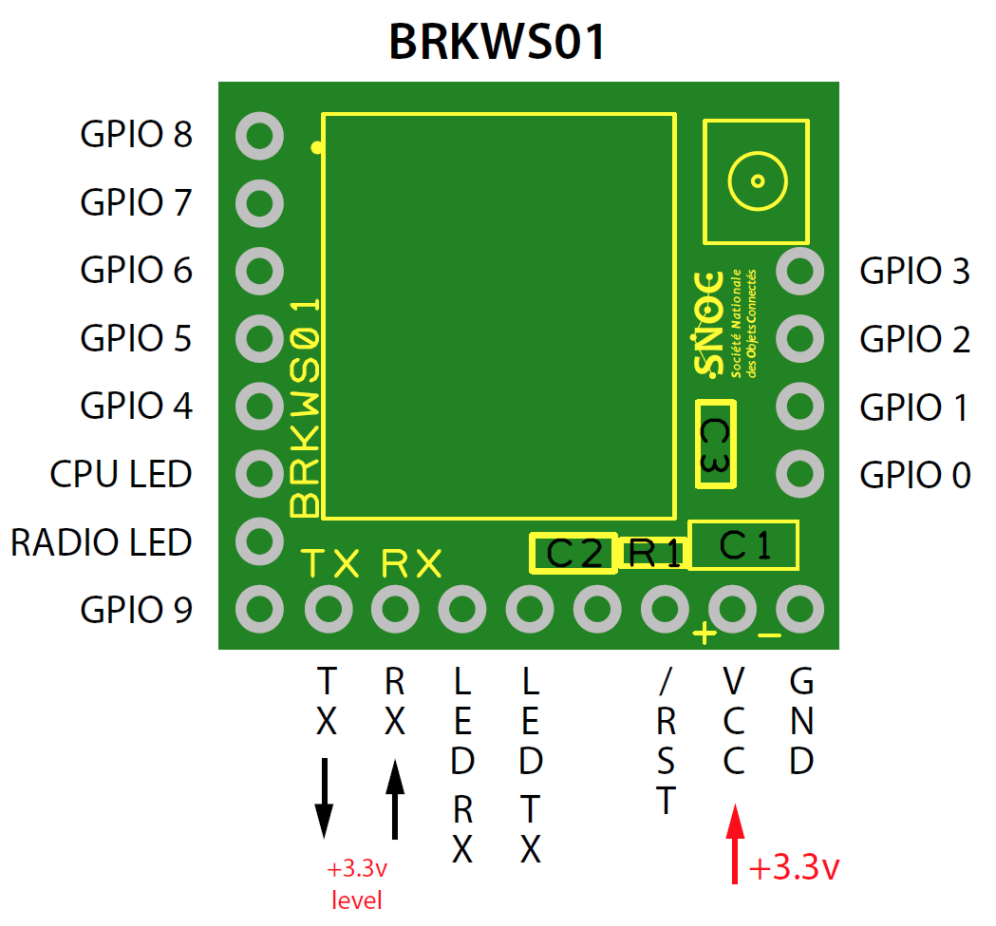
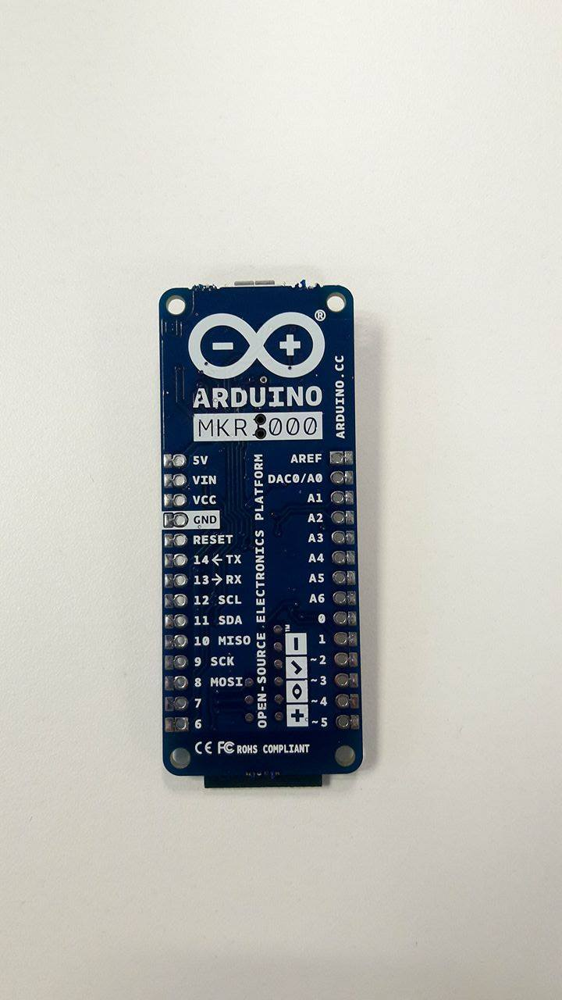
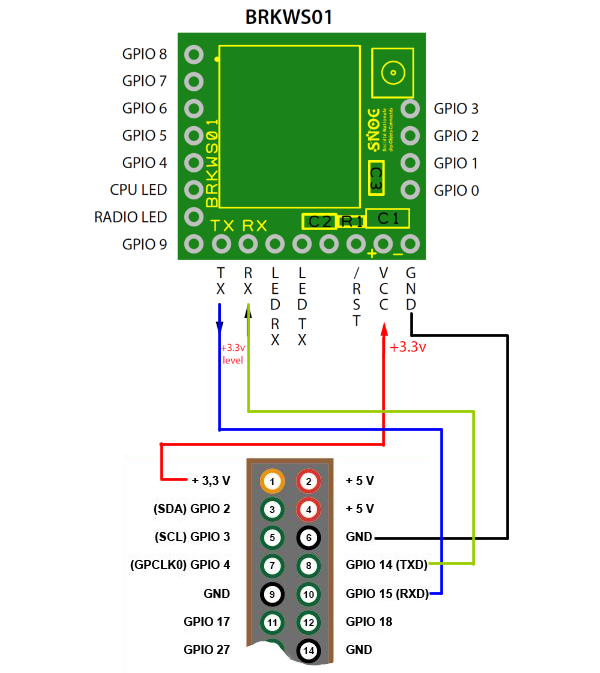
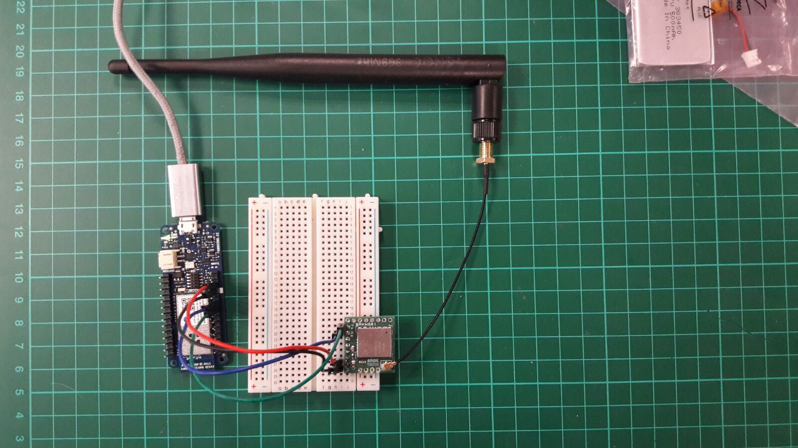
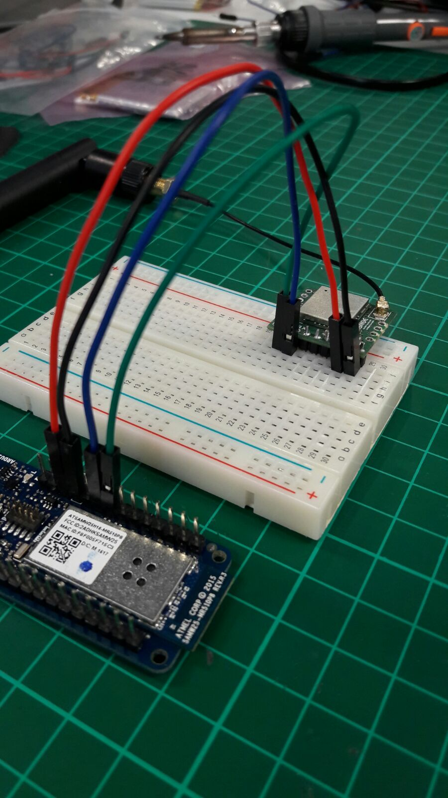
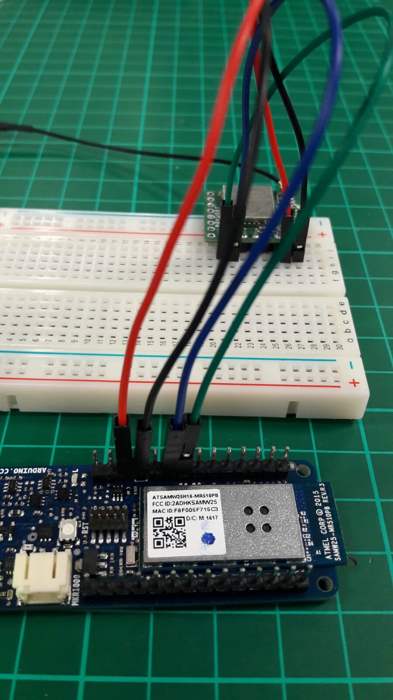
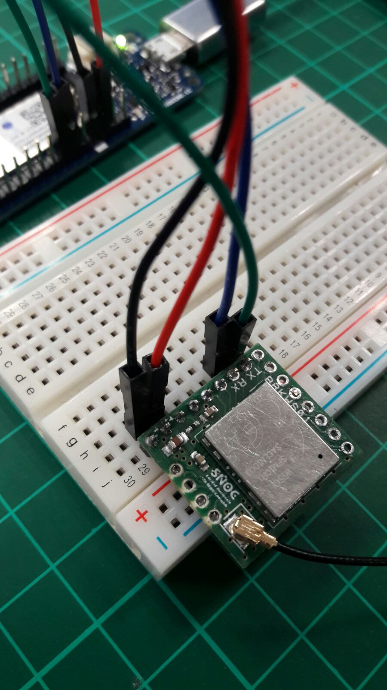
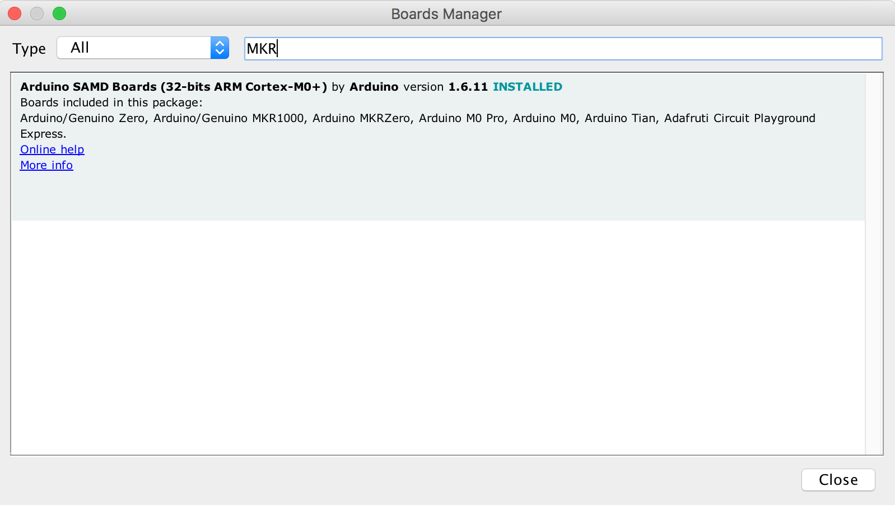
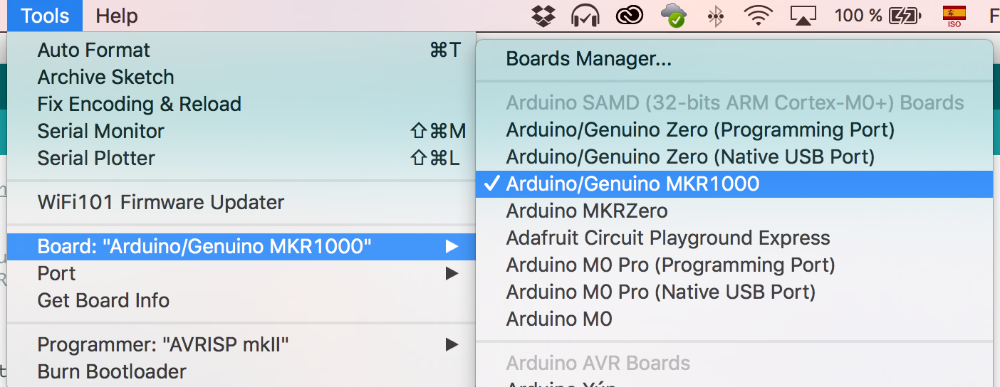
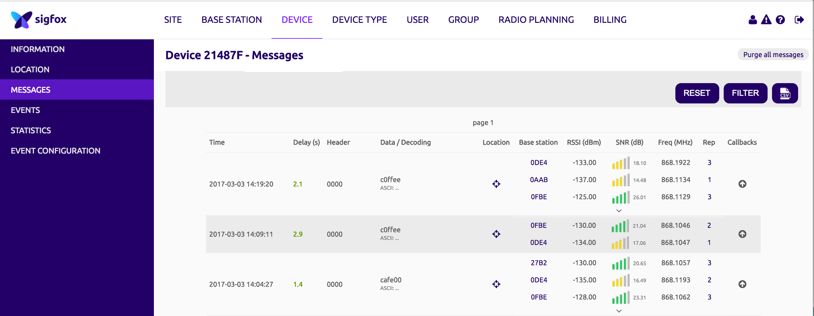

# Sigfox-Wifi-Geoloc-Hardware
This project will show you how to scan a wifi network with the Arduino MKR1000 and send the MAC address and the RSSI using the Sigfox Network with the SNOC module.

## Hardware Requirements
* [Arduino MKR1000](https://store.arduino.cc/product/GBX00011)
* [SNOC Breakout Board - Sigfox BRKWS01](https://yadom.fr/carte-breakout-sfm10r1.html)

## Module Schematics

* SNOC Breakout Board:

* Arduino MKR1000:

## Wiring

Thank you [framboise314](http://www.framboise314.fr/carte-de-prototypage-sigfox-par-snoc/) for this connection picture!

## Install Arduino MKR1000 on Arduino IDE

* Get the lastest arduino IDE [here](https://www.arduino.cc/en/main/software).
* Go to Tools > Boards
* Go to Boards Manager and look for MKR1000: 

* Select the Arduino/Guenuino MKR1000:

## Send your first message

Copy past this code in a new project (or open MKR1000-SNOC you've just cloned):

## See your messages in Sigfox Backend

## Additional content

* [Framboise314](http://www.framboise314.fr/carte-de-prototypage-sigfox-par-snoc/)

* [Tutos Instructables](www.instructables.com/member/luisomoreau/)

* [Tutos Hackster](https://www.hackster.io/luisomoreau)
